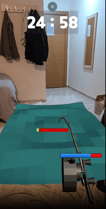

# AR Balık Tutma Oyunu

Bu proje, çocuklara yönelik eğlenceli bir Artırılmış Gerçeklik (AR) balık tutma oyunudur. Unity ve AR Foundation kullanılarak geliştirilmiştir.

  
  
  

  
  

## Proje Açıklaması

AR Balık Tutma Oyunu, çocukların eğlenceli bir şekilde balık tutma deneyimi yaşamalarını sağlayan bir mobil uygulamadır. Uygulama AR teknolojisi kullanarak gerçek dünya yüzeylerini algılar ve bu yüzeylere sanal bir su ortamı yerleştirir. Kullanıcılar bu sanal su ortamında balık tutabilirler.

📲 Kurulum

1. Aşağıdaki bağlantıdan APK dosyasını indir:  
   👉 [Uygulamayı İndir](https://drive.google.com/file/d/11EfH2Ntfh2k-DOjCzNnPQjylq52o1HEu/view?usp=drive_link)

2. Android cihazında **"Bilinmeyen kaynaklara izin ver"** ayarını aktif et:
   - Ayarlar > Güvenlik > Bilinmeyen kaynaklar

3. İndirilen `.apk` dosyasını açarak kurulumu tamamla.

🎮 Oynanış

Uygulamanın nasıl çalıştığını merak ediyorsan, aşağıdaki bağlantıdan kısa oynanış videosunu izleyebilirsin:  
👉<a href="https://www.youtube.com/shorts/FLlgGhMfwlw">Oynanış Videosu</a>

Uygulamanın temel özelliklerini, kullanıcı deneyimini ve nasıl kullanıldığını videoda görebilirsin.

### Özellikler

- AR teknolojisi ile gerçek dünya yüzeylerini algılama
- Algılanan düz yüzeylere sanal su oluşturma
- Sanal ortamda balık tutma deneyimi
- Eğlenceli ve eğitici kullanıcı arayüzü

### Gereksinimler

- Android 7.0 veya daha yüksek sürüm
- AR destekleyen bir mobil cihaz (ARCore uyumlu)
- En az 2GB RAM
- Kamera ve jiroskop sensörü
## Kullanım Kılavuzu

1. Uygulamayı başlatın
2. Düz bir yüzeyi (masa, zemin vb.) telefonunuzun kamerası ile tarayın
3. Sistem düz yüzeyi algıladığında, "Su Oluştur" butonuna basın
4. Sanal su ortamı oluşturulacaktır
5. Oltayı kullanarak balık tutmaya başlayın
6. Oyun arayüzündeki kontrolleri kullanarak farklı özellikleri keşfedin

### İpuçları

- Düz ve iyi aydınlatılmış yüzeyler en iyi sonucu verir
- Telefonu yavaş hareket ettirmek daha iyi yüzey algılaması sağlar
- Yeterli alan olduğundan emin olun (en az 1x1 metre önerilir)

## Geliştiriciler İçin Bilgiler

### Proje Yapısı

- `Assets/Scripts/`: Oyun mekanikleri ve AR fonksiyonlarının kodları
- `Assets/Prefabs/`: Oyunda kullanılan hazır nesneler
- `Assets/Scenes/`: Oyun sahneleri
  - `FirstScene.unity`: Açılış sahnesi
  - `DetectScene.unity`: AR algılama ve oyun sahnesi

### Teknik Detaylar

- Unity sürümü: 2022.3 LTS
- AR Foundation ve ARCore kullanılarak geliştirilmiştir
- Su yüzeyi mesh oluşturma sistemi ile gerçek zamanlı olarak oluşturulur
- Balık davranışları yapay zeka ile kontrol edilir

### Kodlar ve Açıklamaları

- `ARFilterPlanes.cs`: AR yüzey algılama ve filtreleme işlevlerini gerçekleştirir
- `ARFeatheredPlaneMeshVisualizer.cs`: Algılanan AR düzlemlerini görselleştirir
- `CreateWaterMesh`: Su yüzeyinin oluşturulmasını ve fiziksel özelliklerini yönetir

## Sorun Giderme

- **Uygulama çöküyor**: Cihazınızın AR desteğini kontrol edin ve yeterli bellek olduğundan emin olun
- **Yüzey algılanmıyor**: Daha iyi aydınlatılmış ve düz bir yüzeyde tekrar deneyin
- **Performans düşük**: Arkaplanda çalışan uygulamaları kapatın ve cihazı yeniden başlatın

### İletişim

tyfn1963@gmail.com
selim_dync@hotmail.com

## Lisans

Bu proje Yazılım Mühendisliği Güncel Konular dersi için geliştiriliyor. 
